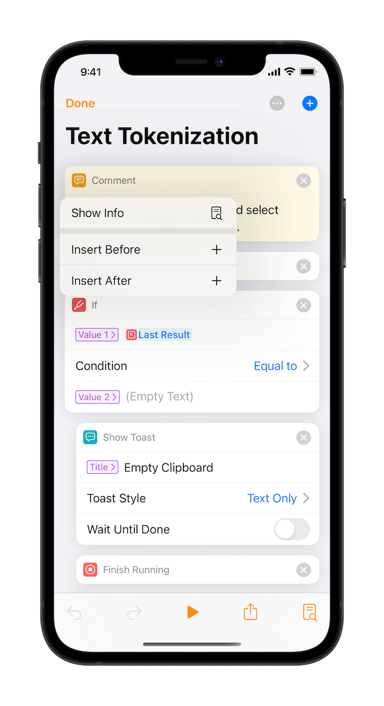

# Actions Basics

Text actions are powerful tools that can be used to process text in the way you prefer.

Essentially, it makes Taio more extensible by introducing a "[Shortcuts](https://support.apple.com/guide/shortcuts/welcome/ios)-like" system, specially designed for text.

If you have used Shortcuts before, you should be comfortable with text actions in Taio.

## Actions Directory

In order to provide more examples regarding creating actions in Taio, we have built [actions directory](https://actions.taio.app) for it.

## Basic Concepts

The actions system in Taio consists of some `action blocks`:

Each action block runs a task, and when it is executed, the result is passed to the next task to continue until all tasks are executed. You can also run some tasks `conditionally` or `repeatedly`, similar to `control-flows` in programming languages.

When you need to save some results for use in subsequent tasks, you can do it by `defining variables`.

Most of the time, the text in an action block is a `template string`, which can be dynamically generated by concatenating static text content and `variables`.

> Action blocks are configured slightly differently depending on the task being performed. You can look up the specific usage of each action, as well as examples, in the action editor.