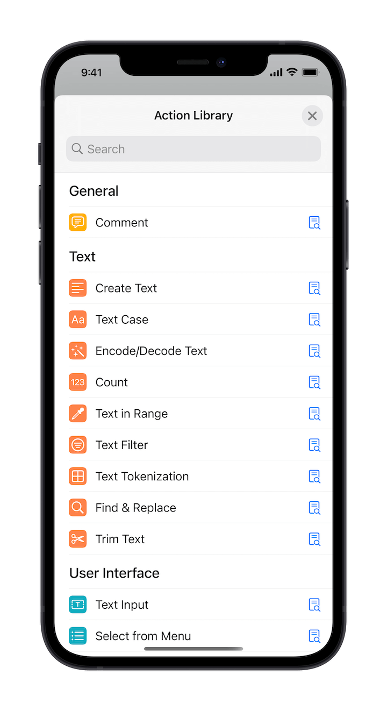

# Action Categories

Since the purpose of different tasks can be various, we have categorized the supported action blocks to facilitate a better search:

## Text

Contains a number of action blocks for manipulating text content, such as:

- Generate a text
- Convert text cases
- Encode or decode text
- Count text length
- Extracts text in the specified format
- ...

## User Interface

A number of actions are provided for displaying the user interface, such as:

- Request user input
- Select option from the menu
- Show alert messages
- Render HTML Content
- Compare difference visually
- ...

## List

When the input text is multiple lines separated by a newline character, it can be processed as a list:

- Filter by line
- Remove duplicate lines
- Reverse order by line
- Split or merge lines
- ...

## Editor

This category consists of two parts, the first of which relates to documentation:

- Create document
- Open document
- Get file name
- ...

Part two provides features to enhance text editing:

- Intelligent select content
- Expand the selection
- Move cursor position
- Replace the selected text
- ...

## Clips

Contains a series of actions for manipulating Taio's clippings:

- Save clippings
- Delete clippings
- Update clippings
- Pin clippings
- ...

## Scripting

Control flow for running actions, such as:

- Run when certain conditions are met
- Wait a certain amount of time
- Directly stop running
- Set or get variables
- Run actions repeatedly
- Run JavaScript
- ...

## Utility

A number of common utilities, such as:

- Look up dictionary definition
- Operate the clipboard
- Math calculations
- Open links
- Invoke HTTP requests
- ...

## Sharing

Share contents using system sharing functionality, such as:

- Open share sheet
- Compose emails
- Compose text messages
- ...

> Action blocks are configured slightly differently depending on the task being performed. You can look up the specific usage of each action, as well as examples, in the action editor.