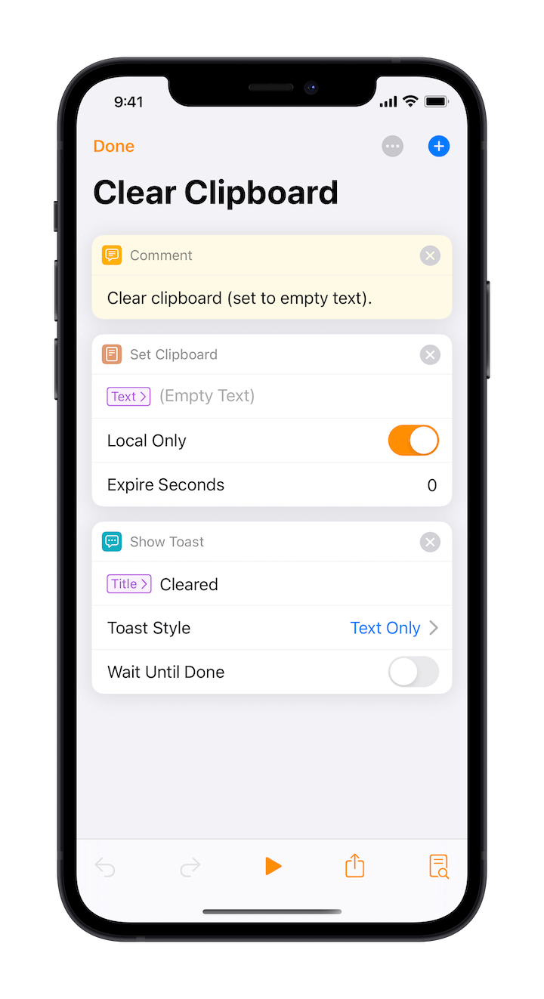

# Control Flow

As mentioned before, Taio's actions system support sequential, conditional, and repeated execution. Similar to control flow in programming languages, the flexible execution allows for more complex tasks.

## Sequential Execution

The default action execution method is sequential, with tasks executed one by one from top to bottom:

If an action has output, its result is passed on and subsequent actions can retrieve it using the `Last Result` variable.

## Conditional Execution

In many cases we need to selectively perform tasks such as:

In this example, if we find that the input is empty, we display a message and stop running early.

## Repeated Execution

Sometimes we want to perform a task repeatedly, for example:

This example will show the message twice. In addition, Taio also supports running the same action repeatedly for each line of a list.