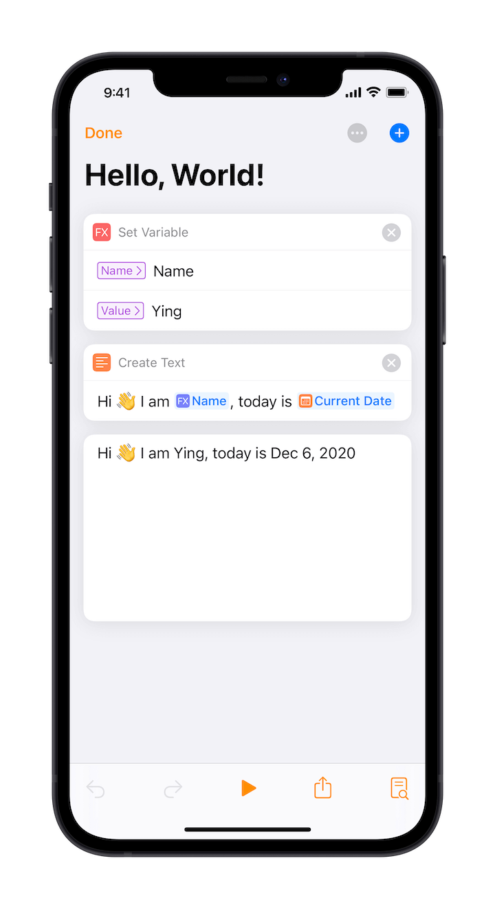
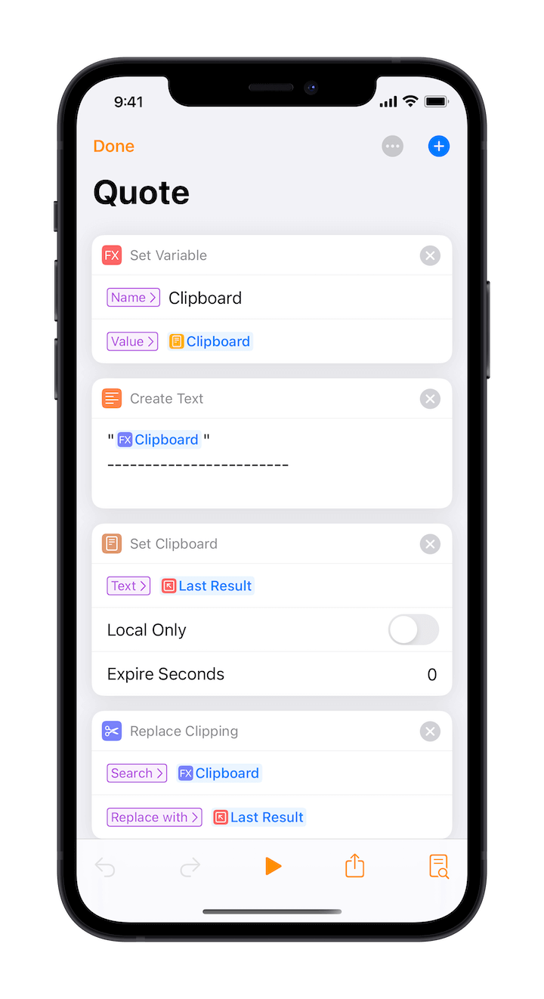
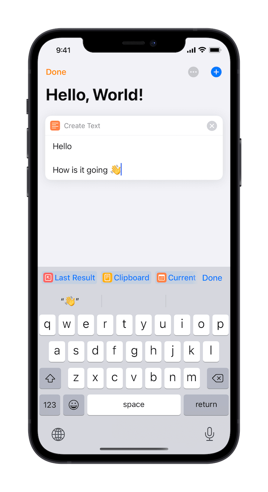
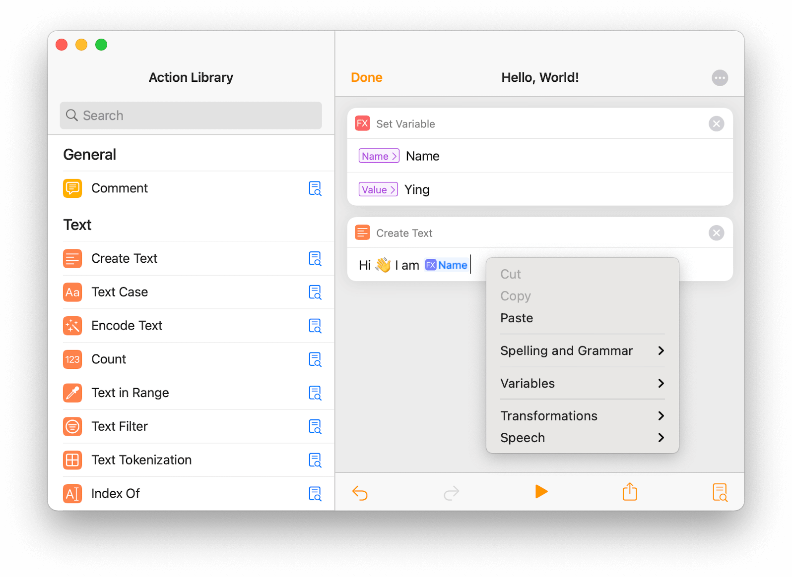
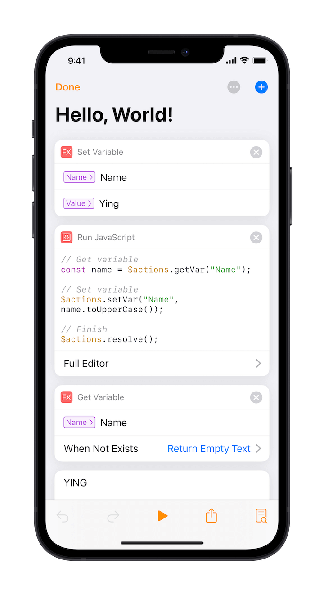

# Variables

As mentioned before, for actions that produce output, the result is passed on to subsequent actions. However, there are times when we need to save a value for later use:

In the above example, `Name` is a variable that can be retrieved and used after it has been defined.

## Use Case

If your actions are simple, it may be sufficient to pass the output of each action directly. However, in many cases we may need to process multiple outputs and use some of the values repeatedly, in which case we need to define variables.

As shown in the screenshot above, we have implemented a workflow to process the clipboard content. We first need to know what the current clipboard is, and then add some content based on it. To replace it, we need to know what the original clipboard content is, so we need to define variables.

## Built-in Variables

In addition to user-defined variables, Taio also has a number of built-in variables:

At the keyboard toolbar, there are variables such as `Last Result`, `Clipboard`, `Current Date`, etc., which can be used directly without defining.

## Using Variables on Mac

On Mac, there's no toolbar to insert variables. Instead, you can right click the mouse to do that:

## Using Variables in JavaScript

Variables defined by the action blocks can also be retrieved and used in [JavaScript](actions/scripting.md):

The screenshot above shows how to get a defined variable and update its value in a script.