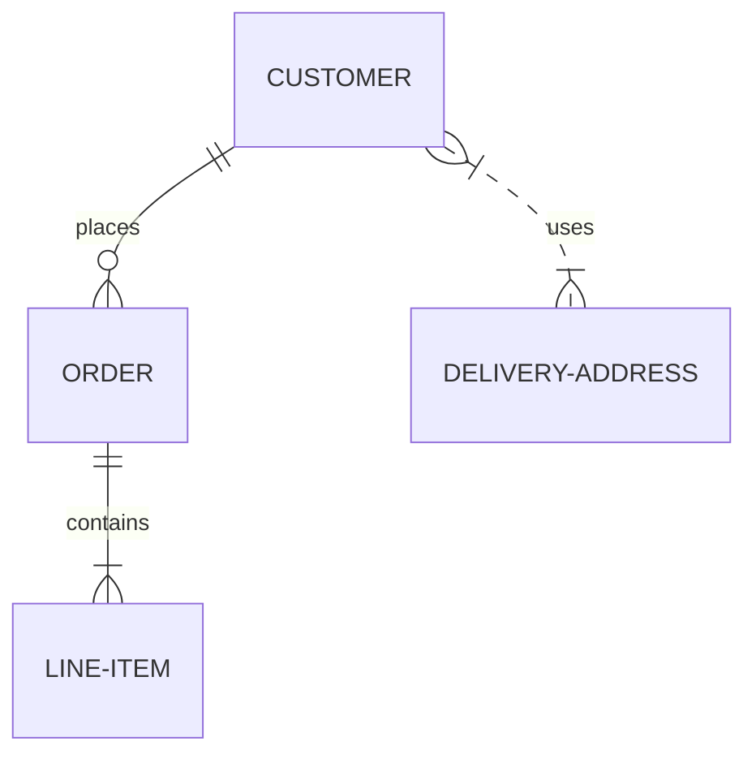

# 绘制图表

Taio 支持多种图表绘制方案，都通过插入代码的方式实现，在预览 HTML 的时候可以绘制成图表。

这里仅介绍如何在 Markdown 嵌入这些内容，请参考各自的官方文档了解更多细节。

## Sequence Diagrams

此功能使用 [js-sequence-diagrams](https://bramp.github.io/js-sequence-diagrams/) 实现，您可以使用以下方式在 Markdown 内容中嵌入：

<pre style="padding-top: 12px; padding-bottom: 2px">
```sequence
Alice->Bob: Hello Bob, how are you?
Note right of Bob: Bob thinks
Bob-->Alice: I am good thanks!
```
</pre>

```sequence
Alice->Bob: Hello Bob, how are you?
Note right of Bob: Bob thinks
Bob-->Alice: I am good thanks!
```

也即使用标识符 `sequence` 嵌入其代码。

## Flowcharts

此功能使用 [flowchart.js](http://flowchart.js.org/) 实现，您可以使用以下方式在 Markdown 内容中嵌入：

<pre style="padding-top: 12px; padding-bottom: 2px">
```flow
st=>start: Start
op=>operation: Your Operation
cond=>condition: Yes or No?
e=>end

st->op->cond
cond(yes)->e
cond(no)->op
```
</pre>

```flow
st=>start: Start
op=>operation: Your Operation
cond=>condition: Yes or No?
e=>end

st->op->cond
cond(yes)->e
cond(no)->op
```

也即使用标识符 `flow` 嵌入其代码。

## Mermaid

此功能使用 [mermaid](https://mermaid-js.github.io/mermaid/#/) 实现，您可以使用以下方式在 Markdown 内容中嵌入：

<pre style="padding-top: 12px; padding-bottom: 2px">

</pre>


也即使用标识符 `mermaid` 嵌入其代码。

## PlantUML

此功能使用 [PlantUML](https://plantuml.com) 实现，您可以使用以下方式在 Markdown 内容中嵌入：

<pre style="padding-top: 12px; padding-bottom: 2px">
```plantuml
Alice -> Bob: Authentication Request
Bob --> Alice: Authentication Response

Alice -> Bob: Another authentication Request
Alice <-- Bob: Another authentication Response
```
</pre>


也即使用标识符 `plantuml` 嵌入其代码。

> 或者，您也可以使用 @startuml 和 @enduml 来嵌入上述代码。