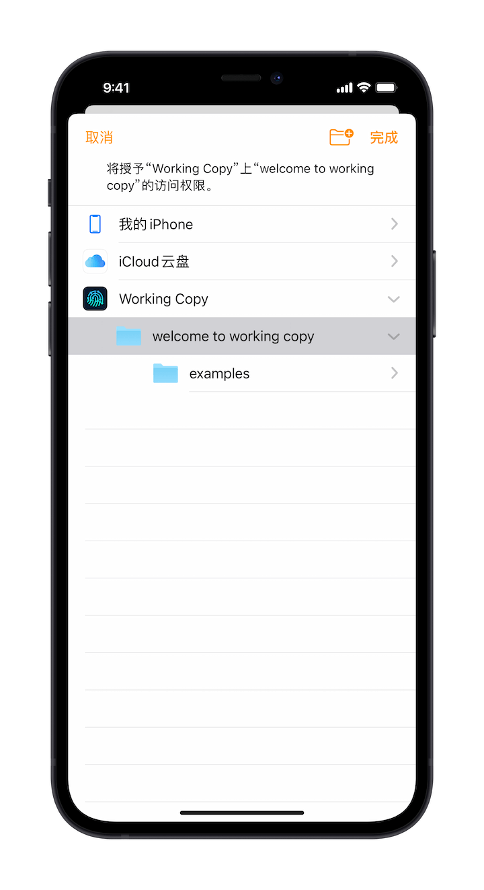

# Working Copy

[Working Copy](https://workingcopyapp.com/) 是 iOS 平台上极为出色的 **Git 客户端**，它可以让您在 iOS 设备上通过 [Git](https://git-scm.com/) 进行版本控制，不管是自建的 Git 服务器，还是诸如 GitHub 一类的平台。

> 注：Working Copy 并非 Taio 团队开发。

## 在 Taio 中使用

Taio 支持完全开放的文件系统，例如：

- 目录开放给系统文件应用
- 支持 Open in Place
- 支持通过文件书签链接外部文件

得益于这些出色的特性，Taio 可以用多种方式通过 Working Copy 管理文件版本，以下简要介绍其中一种。

**链接 Working Copy 目录**

上面截图中出现的目录是被 Working Copy 应用管理的，在文件应用中添加其 File Provider 之后，您可以使用 Taio 的文件书签功能将此目录添加至 Taio：

**使用 Taio 修改文件**

在链接文件书签后，Taio 即可直接编辑 Working Copy 内的文件，此方式直接修改了 Working Copy 内的文件本身，而不是通过复制一个文件得到的：

**使用 Working Copy 管理版本**

使用 Taio 完成改动之后回到 Working Copy，即可对比改动内容，并使用 Git 进行版本管理：

