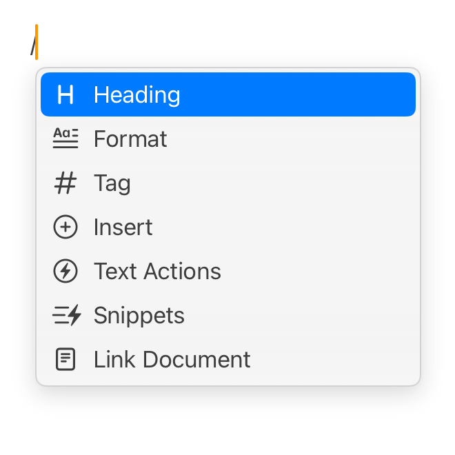
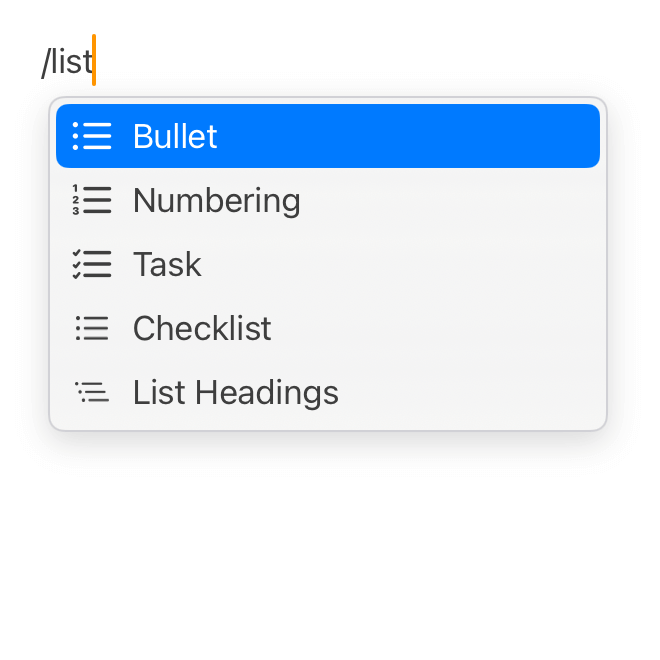
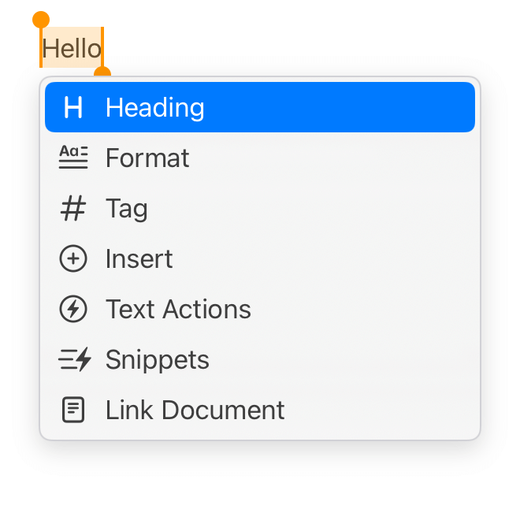

# Command Palette

Command palette is a great way to perform actions, it provides an interactive dialog to easily interact with the editor.

## Showing the Panel

The easiest to show command palette is entering a `/` (slash sign).

With this dialog, we can change text styles, insert tags and snippets, and run text actions.

> If we are on a sub-menu, we can return to the main menu by pressing the backspace key.

## Filtering Commands

Commands are searchable, we can filter out commands we are looking for easily.

## Dealing with Text Selections

If the text selection is not empty, we probably don't want to delete it by inserting a slash sign. To deal with that, we can also trigger the command palette by pressing `⌘ /`.

