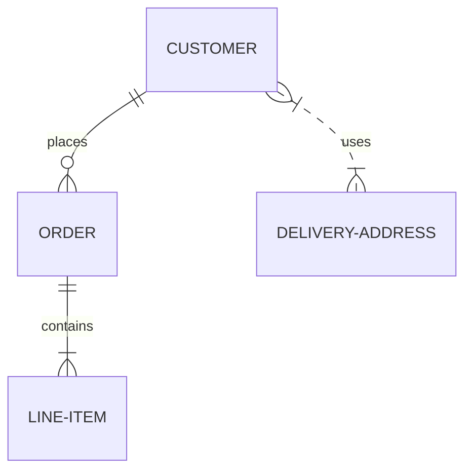

# Diagrams

Taio supports several ways to draw diagrams, all of which are implemented by inserting code that can be drawn as a diagram when previewing HTML.

Please refer to the their official documentation for more details, and here's a brief introduction on how to embed diagrams in Markdown.

## Sequence Diagrams

This feature is implemented using [js-sequence-diagrams](https://bramp.github.io/js-sequence-diagrams/), you can use it as following:

<pre style="padding-top: 12px; padding-bottom: 2px">
```sequence
Alice->Bob: Hello Bob, how are you?
Note right of Bob: Bob thinks
Bob-->Alice: I am good thanks!
```
</pre>

```sequence
Alice->Bob: Hello Bob, how are you?
Note right of Bob: Bob thinks
Bob-->Alice: I am good thanks!
```

That is, embedding the code using identifier `sequence`.

## Flowcharts

This feature is implemented using [flowchart.js](http://flowchart.js.org/), you can use it as following:

<pre style="padding-top: 12px; padding-bottom: 2px">
```flow
st=>start: Start
op=>operation: Your Operation
cond=>condition: Yes or No?
e=>end

st->op->cond
cond(yes)->e
cond(no)->op
```
</pre>

```flow
st=>start: Start
op=>operation: Your Operation
cond=>condition: Yes or No?
e=>end

st->op->cond
cond(yes)->e
cond(no)->op
```

That is, embedding the code using identifier `flow`.

## Mermaid

This feature is implemented using [mermaid](https://mermaid-js.github.io/mermaid/#/), you can use it as following:

<pre style="padding-top: 12px; padding-bottom: 2px">

</pre>


That is, embedding the code using identifier `mermaid`.