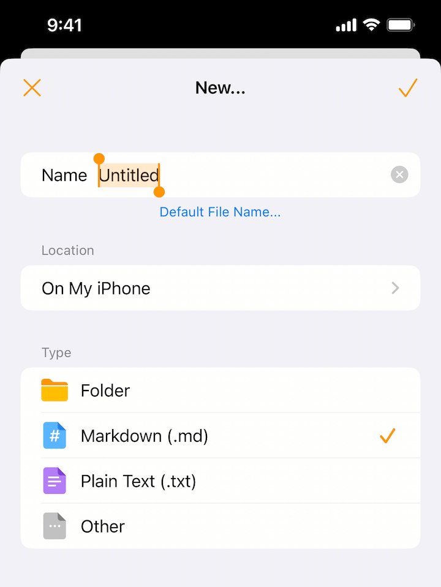
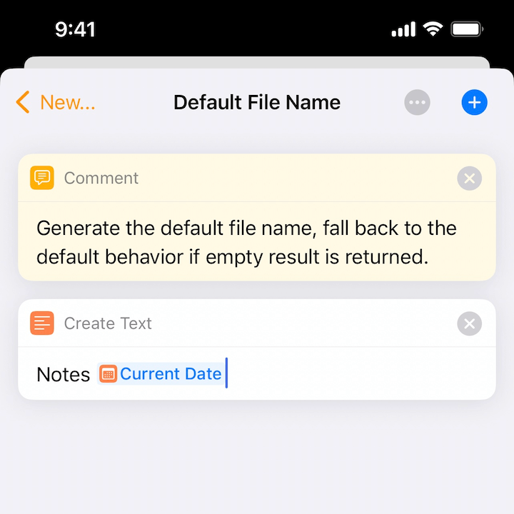
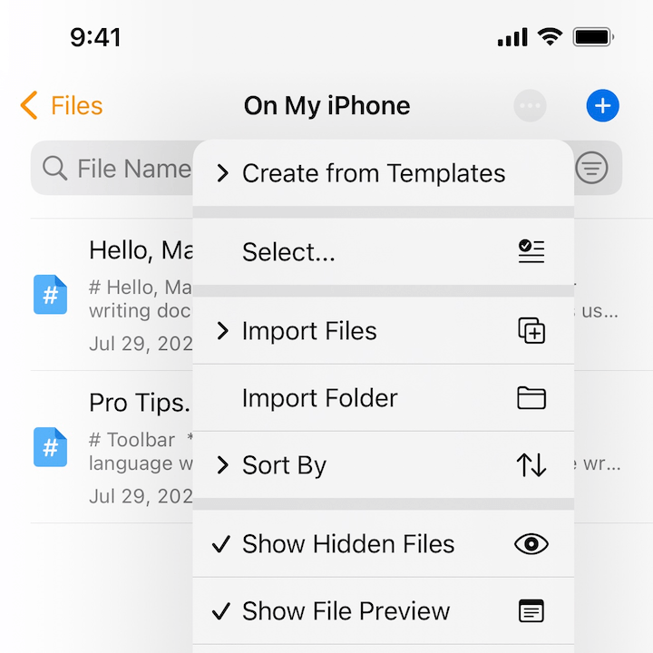
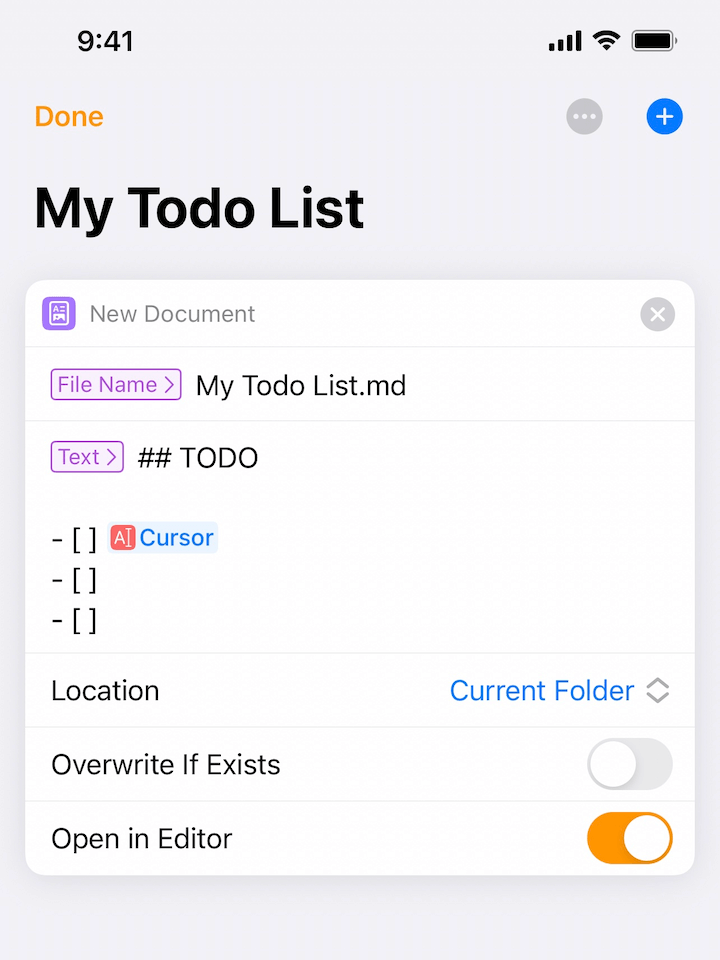

# File Creation

Creating files in Taio is flexible, and there are several powerful ways to make this workflow work for everyone.

## Default File Name

Instead of using `Untitled` as the default file name, you can customize it by leveraging the [text actions](actions/basics.md) system.

Just select `Default File Name...` and set it up.

This feature can be really powerful, you can even generate the result by using advanced scripting, please refer to [text actions](actions/basics.md) for more information.

## File Templates

Having default file name is not enough, sometimes we also want to configure the default file content, and this can be done by using templates.

To use them, just choose `Create from Templates` in the file explorer.

Just like default file name, `File Templates` are also based on [text actions](actions/basics.md). You can easily configure the content and place the text cursor to wherever you like.

> You can even decide the text selection for a newly created file.