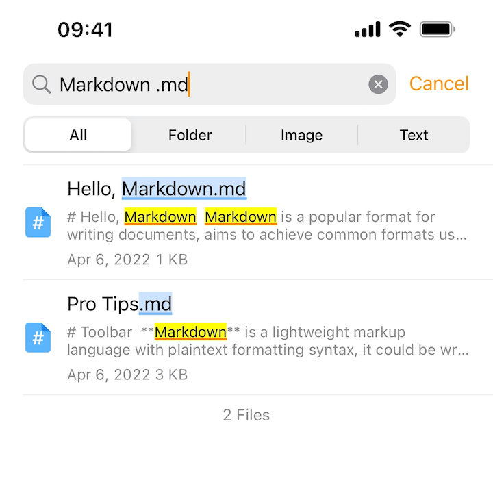
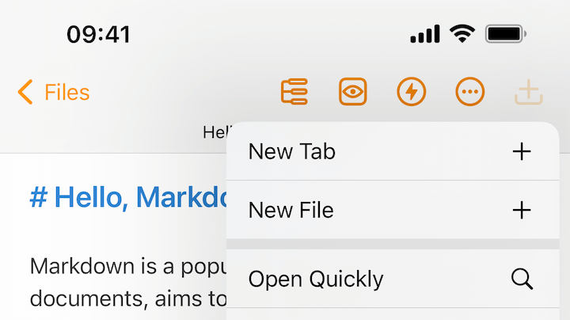
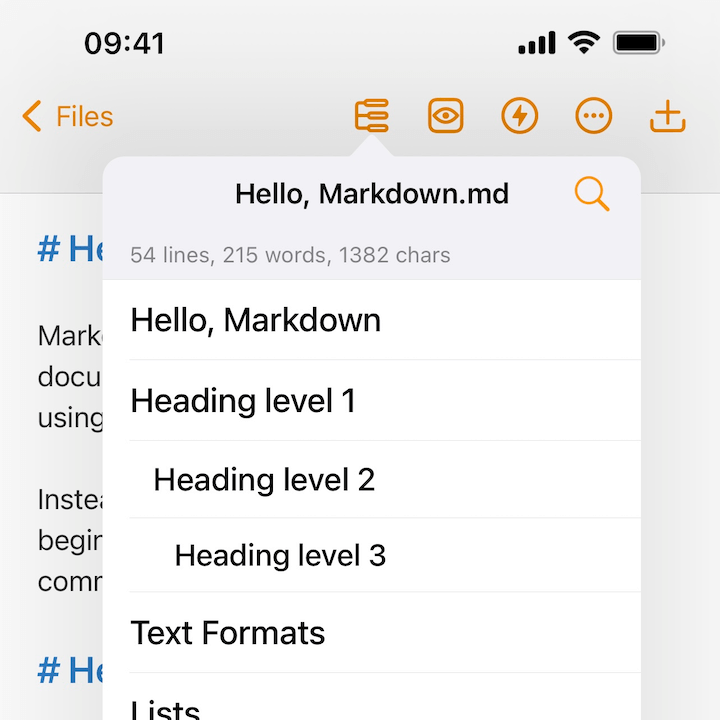
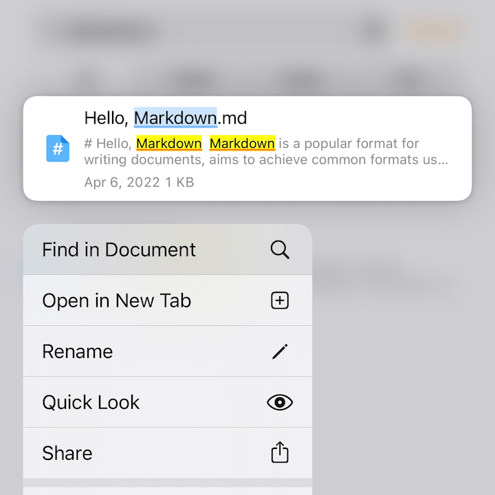
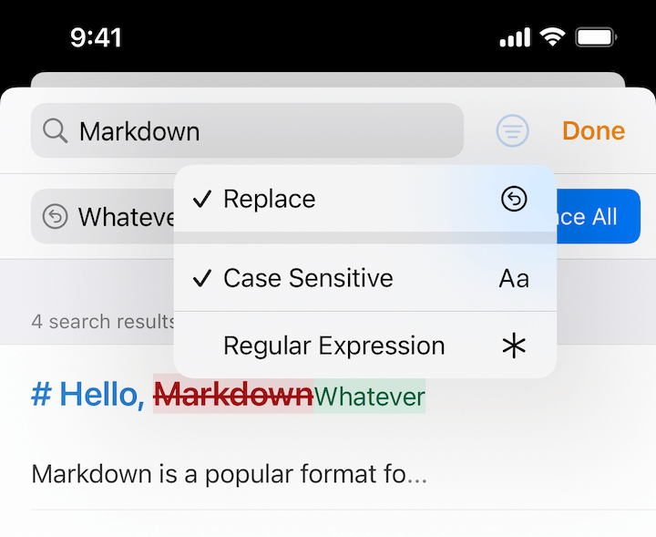
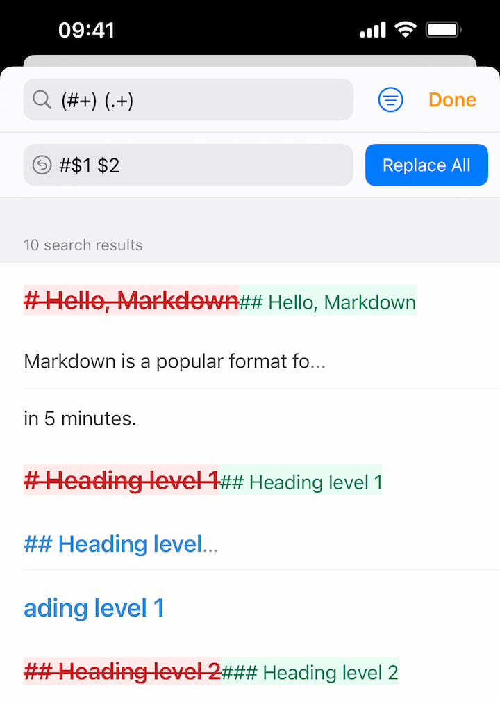

## Full Text Search

In file explorer, you can search both file name and content, with support for fuzzy matching, case sensitive, and regular expressions.

Search results are beautifully highlighted.

You can also search multiple terms in one query using `space` as delimiters, such as `Markdown plaintext`, it searches for file name or file content that contains both `Markdown` and `plaintext`.

> Full text search automatically searches sub-folders, it takes some time when you have huge amount of files. If you use external folders, make sure to only link necessary files into Taio, otherwise it may have a significant performance drop.

## Open Quickly

With the powerful global search, you can also open files quickly.

If you are using an external keyboard on Mac or iPad, "⌘ ⇧ O" will also bring this up.

## Find in Document

When you are editing a document, you can also find in document.

Just open the outline view and tap the search button.

When you are doing a full text search, you can also continue the search in found documents by using contextual menu.

## Search and Replace

You can search and replace with advanced options, including case sensitive and regular expressions, preview results with diff view.

When searching for regular expression groups, `$number` can be used to retrieve captured group matches. For instance, if we want to increase all headings by a level.

