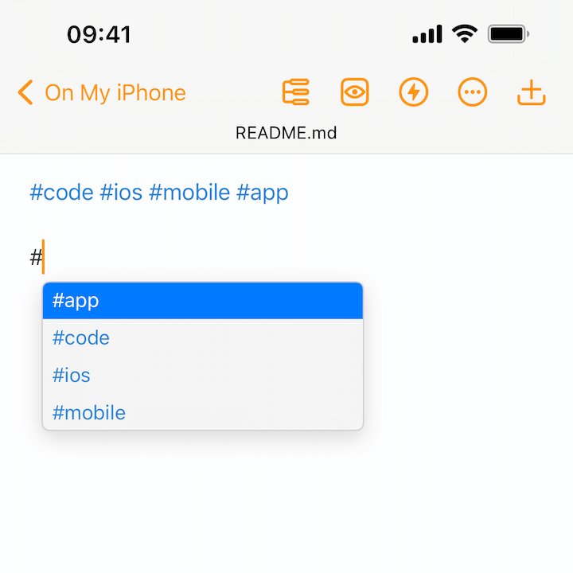
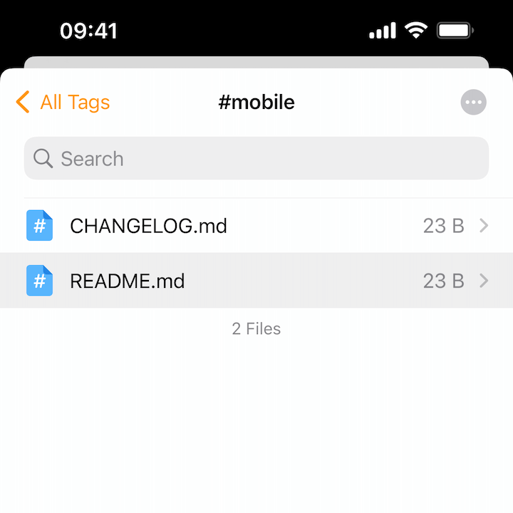
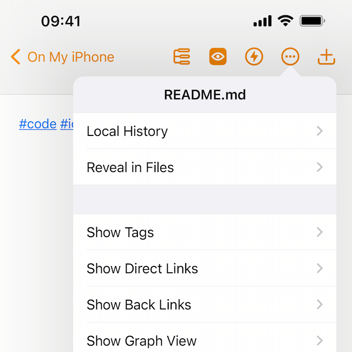
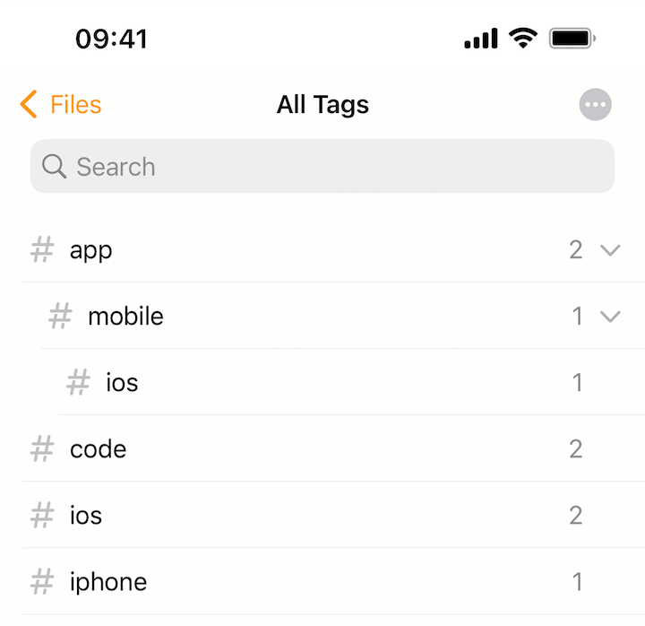

# Tags

Tags are a great way to organize files easily, you can create categories without having actual folders.

## Creating Tags

You can create tags at anywhere in a document, just type `#` and a keyword, such as `#tag`.

Note that, to reduce false positives when detecting tags, tags require necessary leading and trailing spaces.

For example, `#tag1 #tag2` are two tags, but `#tag1#tag2` is not a valid tag.

## Auto Completion

When you start typing with "#", Taio automatically searches tags in all files and shows recommendations.

To complete the input, simply press `tab` or `return`, or select one item on the screen, you can also navigate candidates by using arrow keys.

## Searching Tags

It's easy to find all files that contain a given tag.

When you're in preview mode or haven't started editing, tags work the same as links, you can just tap (or click, with a mouse) on them.

When you're editing a file, just hold the command (⌘) key on your keyboard to make tags and links clickable.

Similar to links, there's also a way to quickly find all tags in a document. You can do that by going editor options, show tags.

## Nested Tags

Can a tag belong to another tag? Yes, tags can be nested.

Feel free to create tags with structure like `#app/mobile/ios`, Taio knows its hierarchy.

## Potential Performance Issues

Taio searches tags in all files and caches the results, the scale of files can definitely impact the speed of indexing files.

Based on our observation, it works seamlessly with thousands of files. However, if you have tens of thousands of files in your workspace, it may take multiple seconds to complete the indexing process.

To avoid situations like this, we recommend you archive old files to somewhere else if you do have tons of files.

> For the same reason, tags don't work for external folders and files.

## Turning Tags Off

You don't like tags? No worries, find Markdown options in editor settings, turn it off.