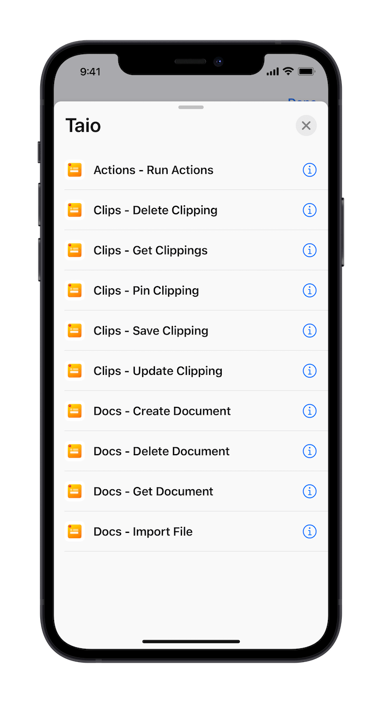
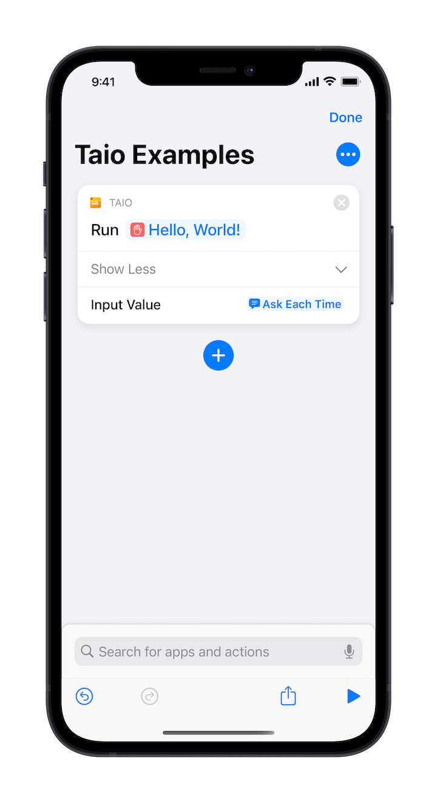
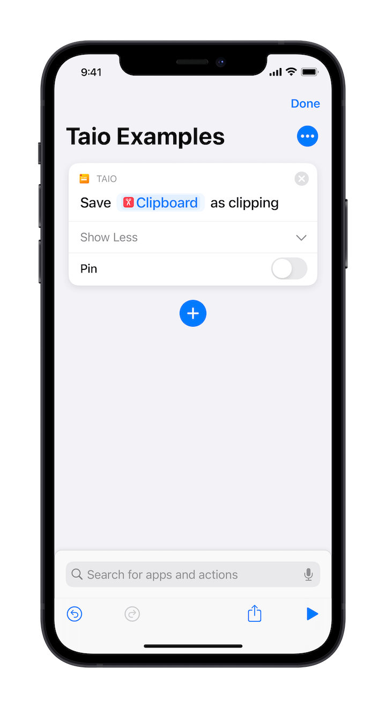
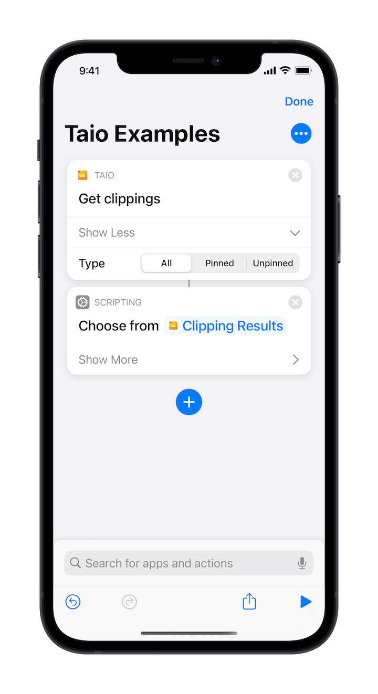
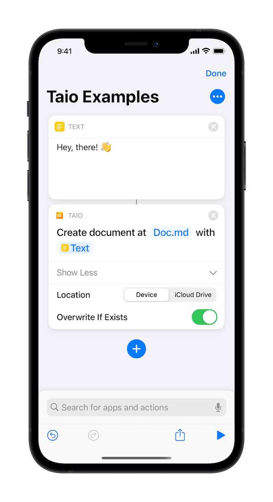
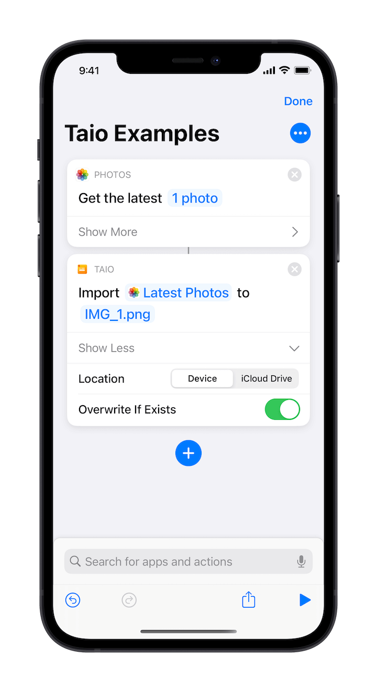

# Shortcuts

We provide rich support for [Shortcuts](https://apps.apple.com/us/app/id915249334) integration, allowing you to integrate Taio's features into your familiar workflow:

The following is a quick introduction, for more information on how to use Shortcuts, please refer to the [user guide](https://support.apple.com/en-sg/guide/shortcuts/welcome/ios) provided by Apple.

To use iOS built-in accessibility features, such as "Back Tap", please refer to the [tutorial](https://support.apple.com/en-us/HT211781) provided by Apple.

## Run Actions

Other than specify the action name, you can also provide an input value:

It will open the Taio app and launch the specified actions.

## Save Clipping

With a simple setup, you can save the clipboard content to Taio:

By leveraging home screen widgets supported by Shortcuts, you can do that without launching the app.

> Note that, on some versions of iOS (E.g., iOS 15.0), the built-in "Clipboard" variable doesn't work. You will see an error, and you can use the "Get Clipboard" action to work it around. This issue is reported to be fixed in iOS 15.1.

## Get Clippings

This action returns saved clippings in Taio, you can specify pinned or not:

It returns a clipping list, you can handle them using list actions.

## Create Document

Create a Taio document with text content, it can be saved to the device or iCloud Drive:

If the file path is invalid, it throws an error.

## Import File

Import any kind of files into Taio, such as photos:

If the file path is invalid, it throws an error.

> We are currently working on more Shortcuts actions, especially for text processing.