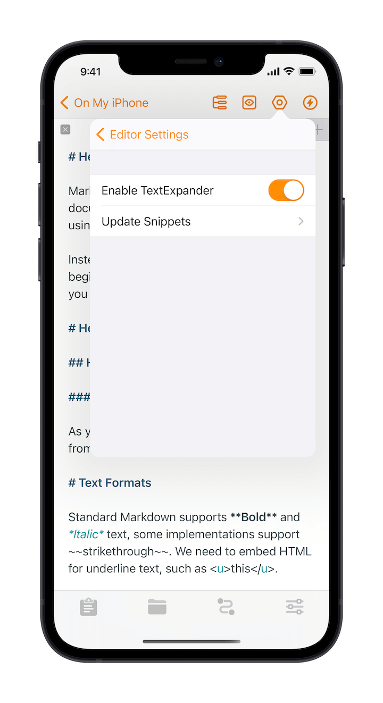

> On Mac, TextExpander can be integrated to the system, it doesn't require any settings in Taio.

# TextExpander

Taio has built-in support for [text snippets](editor/pro-tips?id=text-snippets), which allows you to quickly insert predefined text. If this feature does not meet your needs, or if you are already a [TextExpander](https://textexpander.com/) user, you can also use TextExpander snippets in Taio.

## Configuring TextExpander

> Make sure that you have TextExpander app installed and set up.

In the editor settings, find TextExpander and turn it on, then select "Update Snippets":

This will jump to TextExpander app to get snippets, and when it jumps back to Taio, you are all set.

## Using TextExpander

Once the above settings are complete, you can use snippets in the Taio editor and the editor will automatically complete the text replacement.