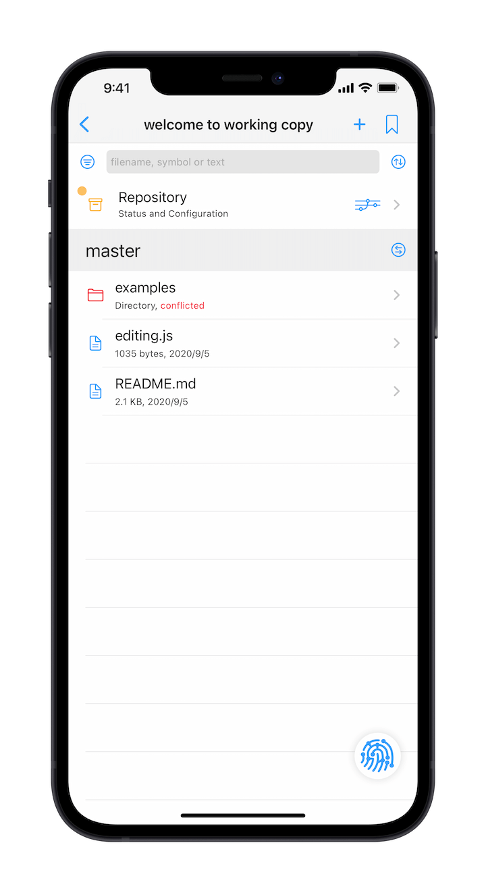
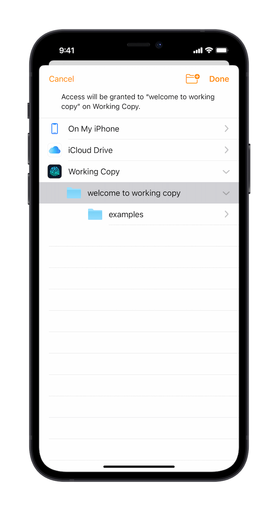
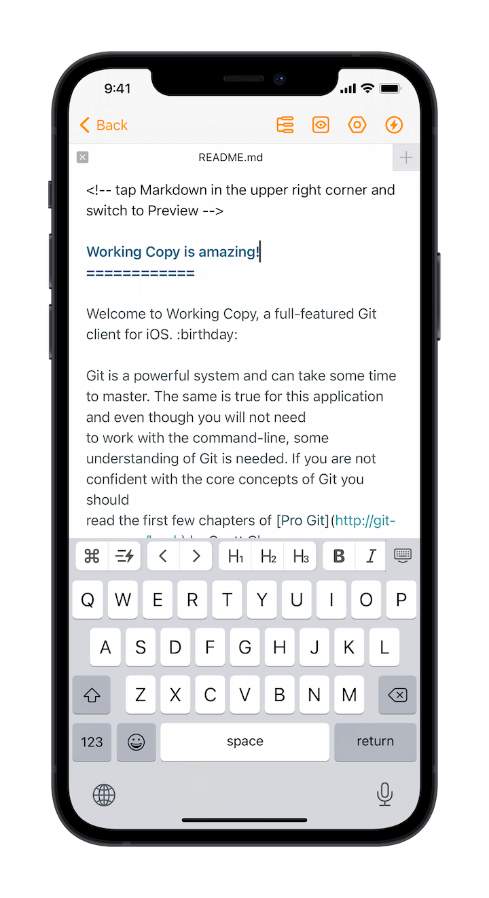
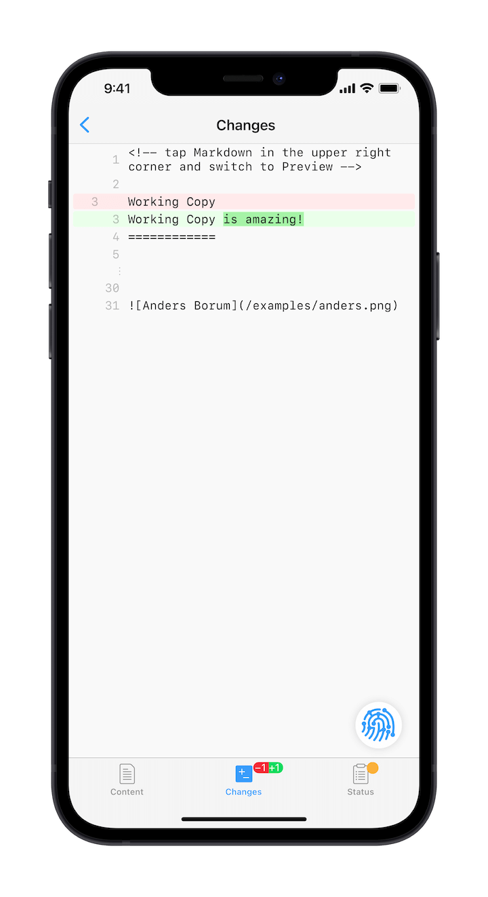

# Working Copy

[Working Copy](https://workingcopyapp.com/) is an excellent **Git client** on iOS that allows you to perform version control via [Git](https://git-scm.com/) on your iOS devices, whether self-hosted Git server, or platform like GitHub.

> Note: Working Copy was not developed by the Taio team.

## Working with Taio

Taio supports fully open file system, such as:

- Full Files app support
- Open in Place support
- File bookmarks support

Thanks to these excellent features, Taio can manage file versions via Working Copy in several ways, one of which is briefly described below.

**Link Working Copy Folders**

The directory shown in the screenshot above is managed by the Working Copy app. After adding its File Provider to the Files app, you can use Taio's file bookmark feature to add this directory to Taio:

**Edit Files in Taio**

After linking a file bookmark, Taio can edit the file inside the Working Copy directly, changes will be directly saved to the original file, rather than by editing a copy:

**Manage Versions with Working Copy**

After making changes with Taio, you can go back to Working Copy to compare your changes and use Git for version control:

