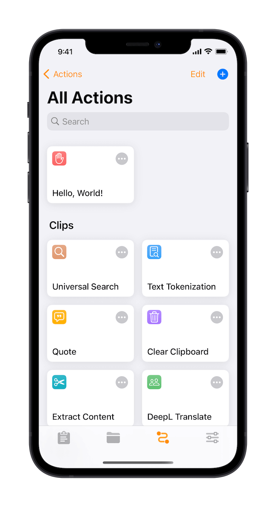
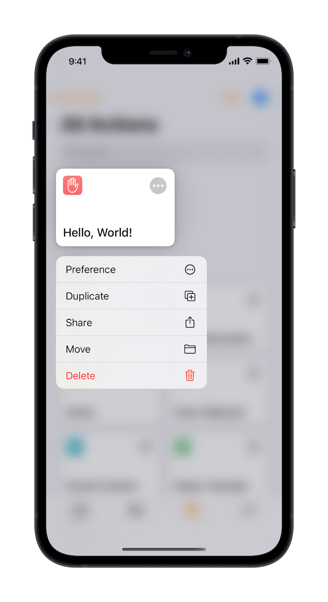
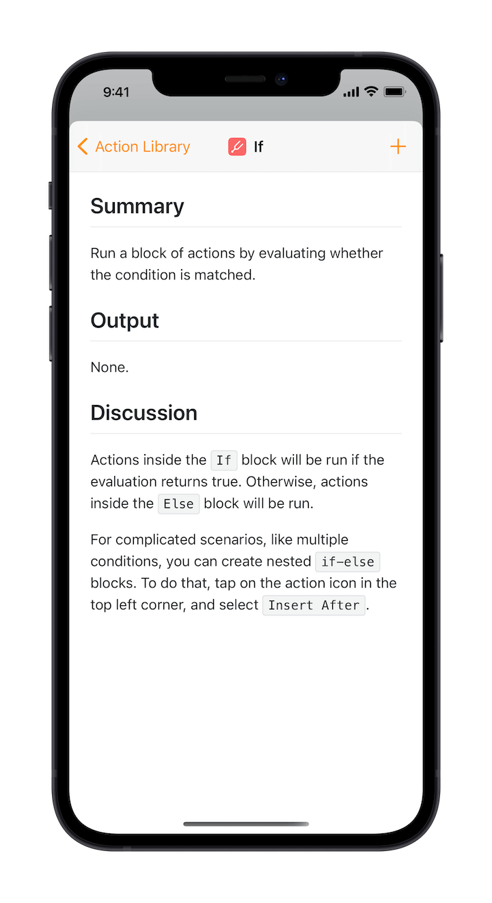
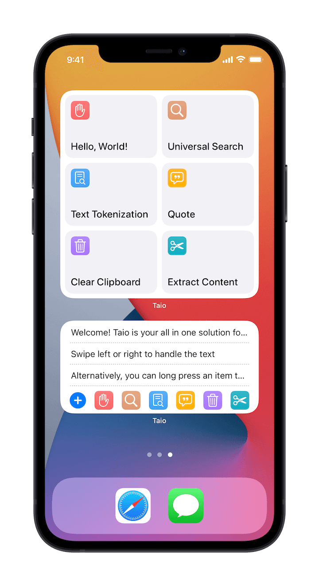

# Text Actions

Taio has designed a text processing system that can be used for both `clipboard` and `editor`. By building text actions, you can customize your own text processing workflow.

Text actions are very powerful and we will introduce later in the [Text Actions](actions/basics.md) section separately.

## Creating Actions

In action gallery, tap the plus button in the upper right corner to create new actions:

Long-press to show the menu, or tap the edit button to perform bulk operations:

## Edit Actions

When editing actions, you can drag and drop to change the position of an action block, and tap the icon in the top left corner to show the menu:

Tap the plus button in the upper right corner to open the action library where you can add new action blocks:

> Pro Tip: You can place an action block directly into proper location by dragging and dropping.

## Documentation

We have prepared documentation for each action block, and there is further discussion for actions that seem complex:

Just tap the document icon for each action block to check it out at any time.

## Using Widgets

For iOS 14 users, we have also made widgets for the actions functionality. You can use the actions widget alone, or a universal widget that combines clipboard and actions:

For adding widgets to your home screen, please refer to the [guide](https://support.apple.com/en-us/HT207122) provided by Apple.

> Pro Tip: Due to system limitations, 3rd-party widgets are not interactive, they are just quick links to open the app.