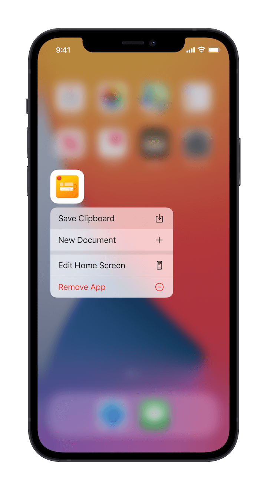
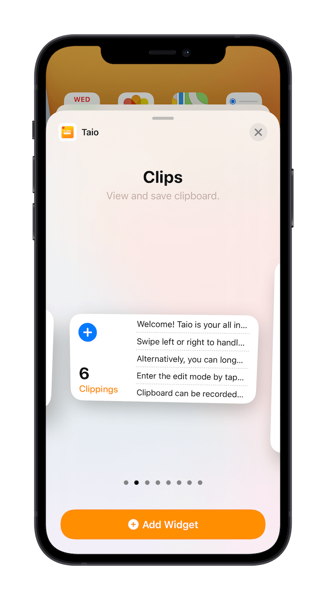
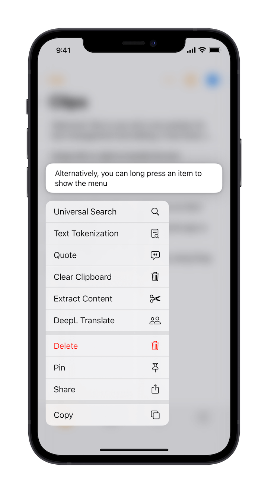
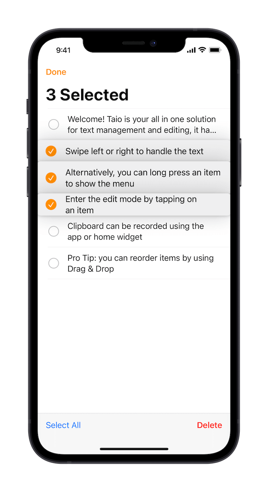

# Clipboard

Taio uses the clipboard as one of the sources of text data, providing the ability to save the clipboard, iCloud sync, and process the clipboard.

## Save Clipboard

After copying the content, you can save the clipboard using the following home screen shortcut:

If you are using iOS 14, you can also use the home screen widget provided by Taio:

For adding widgets to your home screen, please refer to the [guide](https://support.apple.com/en-us/HT207122) provided by Apple.

If you don't use either method, manually switching to the clipboard tab after opening the app will also automatically save the content of the clipboard.

> If you want to save clipboard without launching the app, you can use [Shortcuts](integration/shortcuts.md).

## Working with Clipboard Data

You can initiate an action with clipboard data by long-pressing a specific clipping:

If you don't target a specific item, you can also tap the ⚡️ button in the top right corner to initiate an action.

## Bulk Actions

You can enter the edit mode by tapping on the button in the top left corner (or you can initiate it with a two-finger slide) and then bulk delete or sort the content:

> Pro Tip: In this mode, the checkbox on the left supports sliding for quick selection.