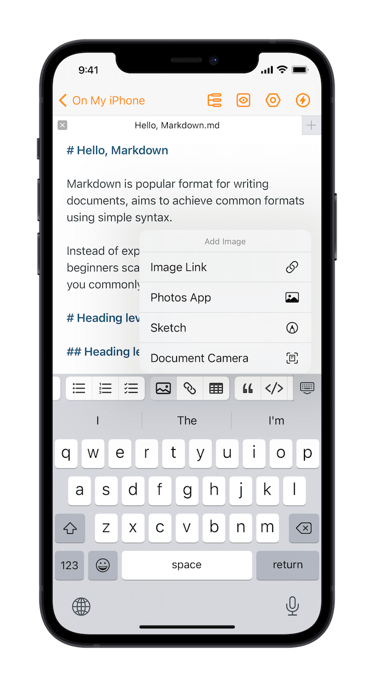
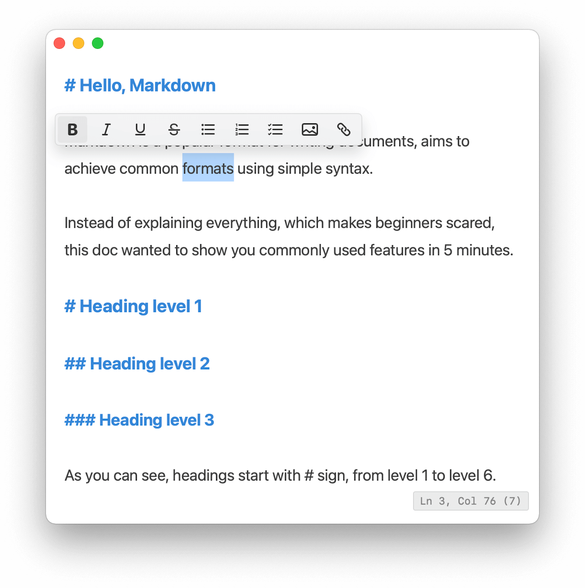
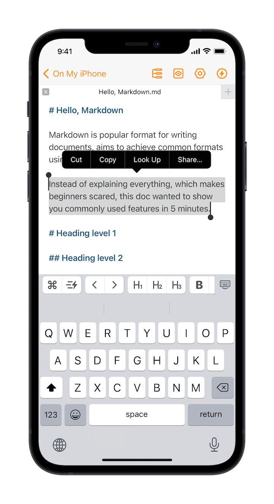
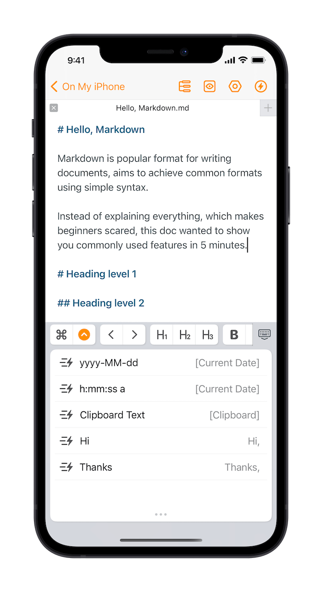
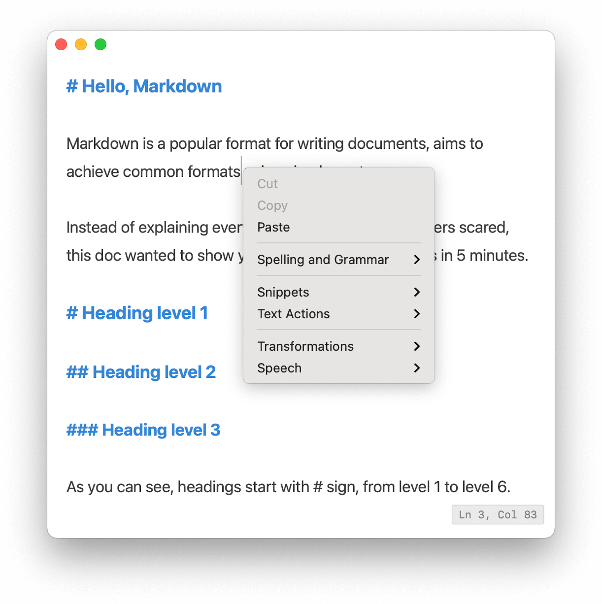
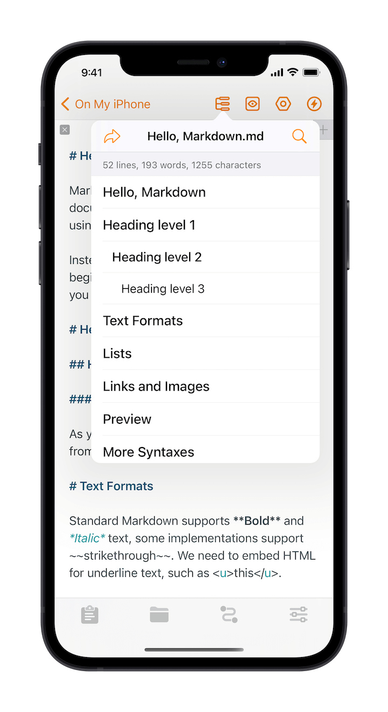
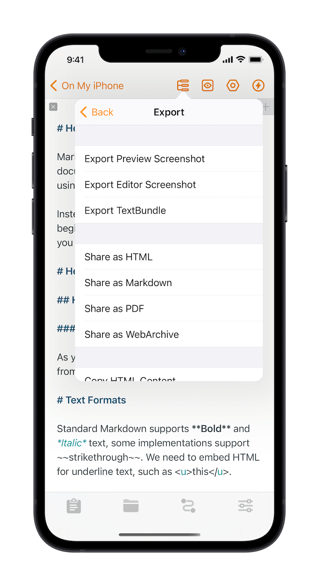
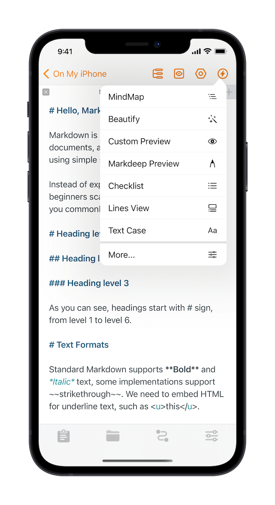

# Editor

Taio provides a Markdown editor that is 100% compatible with the [CommonMark](https://commonmark.org/) and [GitHub Flavored](https://github.github.com/gfm/) standards, using public formats and open file system, allowing you to use them seamlessly in any other applications.

In addition, the editor supports custom actions to implement the text processing workflows, fully unlocking the editor's extensibility.

For more information on using the Markdown syntax, please check the in-app introduction, or other [documentation](https://daringfireball.net/projects/markdown/syntax).

## Toolbar

The editor toolbar brings convenience for using the Markdown format, supporting commonly used Markdown syntaxes, you don't need to input complex symbols by hand:

The toolbar intelligently determines the current selection, e.g., when the area where the cursor is a heading, you do not need to select the title precisely. Toggle bold after selecting a section of text and the bold symbol will wrap around the selected text. There are many more optimizations like this, and we encourage you to experiment and find out the best way for yourself.

On Mac, the toolbar shows dynamically when you select some text, or click on the editing area:

## Gestures

In addition to `swiping left and right` to move the cursor position and `two-finger pinch` to adjust the size, you can also `triple tap` to quickly select the current paragraph:

The same operation can be done in other ways, but the convenient gestures make editing much more faster.

## Snippets

In contrast to the snippets feature supported by many other editors, Taio provides smarter snippets that can be dynamically filled, such as the current date or the clipboard:

 

On Mac, you can right-click the mouse to insert snippets:

You are free to set snippets with the template text for more flexible and fast text insertion.

> Pro Tip: Taio also supports text replacement based on [TextExpander](https://textexpander.com/).

## Outline and Export

Taio will automatically extract all levels of headings in the document, generate an outline view, tapping on the headings can quickly jump to the corresponding location in the document:

Tap the share button in the top left corner to export the document in a variety of common formats:

## Text Actions

Tap the ⚡️ button in the upper right corner to use actions in the editor:

> Pro Tip: If you're using an iPad, you can also do this with keyboard shortcuts (hold the ⌘ key to get a hint).

## Supported Extensions

We are working on custom templates for Markdown preview, which allows you to render any custom format.

Before that, we have also built in some common syntax extensions for Taio:

- [Highlightjs](https://highlightjs.org/)
- [MathJax](https://www.mathjax.org/)
- [Sequence Diagrams](https://bramp.github.io/js-sequence-diagrams/)
- [Flowchart](https://flowchart.js.org/)
- [Mermaid](https://mermaid-js.github.io/mermaid/#/)
- [PlantUML](https://plantuml.com/)

These extensions allow you to highlight code, display math formulas, flowcharts and more in Markdown, see [Math Formulas](editor/math.md) and [Diagrams](editor/diagrams.md) for basic usage. Please refer to their documentation for more information.